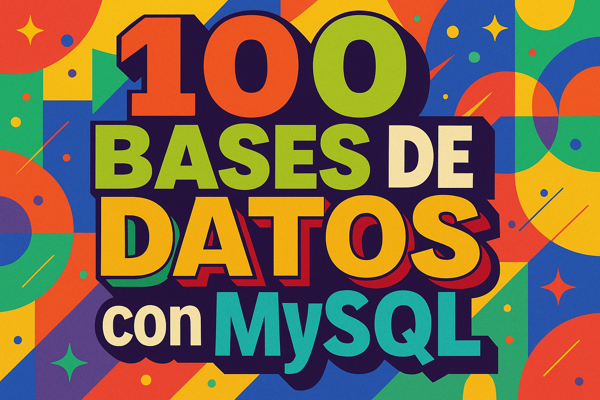

  

# 🗄️🚀 **COLECCIÓN DE BASES DE DATOS MySQL** 💾✨  

🌟 **Bienvenido a mi laboratorio de bases de datos** 🌟  
Aquí encontrarás una **colección de 100 proyectos de bases de datos MySQL**, cada uno con **6 tablas normalizadas**, relaciones bien definidas y **datos de ejemplo reales**.  

> 💡 **Objetivo:** Perfeccionar el diseño, modelado y manipulación de bases de datos SQL, aplicando buenas prácticas y optimización en cada proyecto.  

---

## 🔥 **¿QUÉ ENCONTRARÁS EN ESTE REPOSITORIO?**  

✅ **Estructuras claras y normalizadas** 📐 – Diseño lógico optimizado para integridad y escalabilidad.  
✅ **Relaciones bien definidas** 🔗 – Claves primarias y foráneas correctamente implementadas.  
✅ **Datos de ejemplo realistas** 📊 – Contenido adaptado a escenarios reales y variados.  
✅ **Consultas y scripts listos para usar** ⚡ – Ideal para pruebas, aprendizaje y desarrollo.  
✅ **Organización por categorías** 📂 – 10 áreas temáticas con 10 proyectos cada una.  

🎯 **Este repositorio está diseñado para crecer y adaptarse**, incorporando más ejemplos, prácticas avanzadas y optimizaciones con el tiempo.  

---

## 🛠️ **TECNOLOGÍAS UTILIZADAS**  

💻 **MySQL 8+** – Motor de base de datos relacional robusto y escalable.  
📐 **Modelo Relacional** – Tablas, relaciones y restricciones para garantizar integridad.  
⚡ **SQL (DDL & DML)** – Creación, manipulación y consulta de datos.  
🧭 **Buenas prácticas** – Índices, normalización y consistencia de datos.  

> 🏆 **Enfoque en la calidad del diseño, eficiencia y mantenibilidad de cada base de datos.**  

---

## 🚀 **OBJETIVO DE ESTE REPOSITORIO**  

> 💡 **Este repositorio es un arsenal de ejemplos prácticos de MySQL**, diseñado para aprender, practicar y dominar la construcción de bases de datos de manera profesional.  
